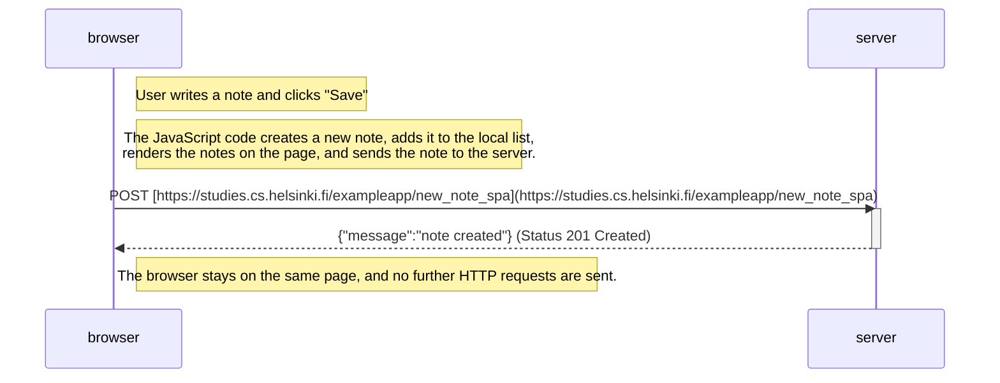

```mermaid
sequenceDiagram
    participant browser
    participant server

    Note right of browser: User writes a note and clicks "Save"

    Note right of browser: The JavaScript code creates a new note, adds it to the local list,<br/>renders the notes on the page, and sends the note to the server.

    browser->>server: POST [https://studies.cs.helsinki.fi/exampleapp/new_note_spa](https://studies.cs.helsinki.fi/exampleapp/new_note_spa)
    activate server
    server-->>browser: {"message":"note created"} (Status 201 Created)
    deactivate server
    
    Note right of browser: The browser stays on the same page, and no further HTTP requests are sent.
```
